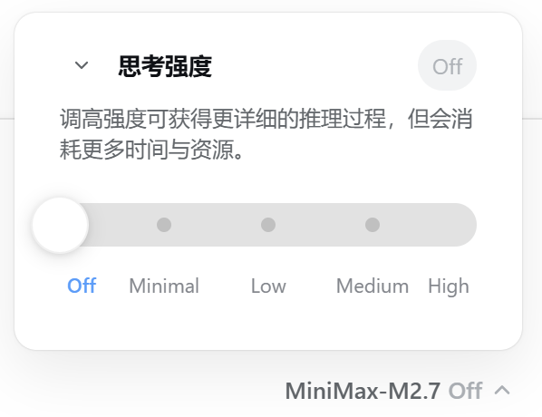

# thinking-slider

[English](./README_EN.md) | [中文](./README.md)

<div align="center">

**A snap-to-step slider for the "thinking strength" (reasoning effort) control in the DSH web UI.**

<br/>

<a href="https://github.com/Motuo24/dsh-thinking-slider/stargazers"></a>
<a href="https://github.com/Motuo24/dsh-thinking-slider/blob/main/LICENSE"></a>
<a href="https://github.com/Motuo24/dsh-thinking-slider"></a>
<a href="https://github.com/Motuo24/dsh-thinking-slider"></a>
<a href="https://github.com/topics/dsh-plugin"></a>

**Turn the model picker's discrete effort buttons into a smooth, springy slider.**

</div>

## 📑 Table of Contents

- [✨ Introduction](#-introduction)
- [🎯 Features](#-features)
- [🖼️ Screenshots](#️-screenshots)
- [🔧 How it works](#-how-it-works)
- [🚀 Installation](#-installation)
- [🔄 Update](#-update)
- [❓ FAQ](#-faq)
- [🧩 Compatibility](#-compatibility)
- [🛠️ Development](#️-development)
- [📋 Changelog](#-changelog)
- [⚠️ Known limitations](#️-known-limitations)
- [🤝 Contributing](#-contributing)
- [📄 License](#-license)

## ✨ Introduction

When using the DSH web UI, adjusting how "deeply" a model thinks — its thinking strength (reasoning effort) — hides behind a second-level menu in the model picker as a row of discrete buttons: `Default` / `Off` / `High` / `Max`. Clicking is straightforward, but for a concept that is inherently a continuous gradient, a button list is neither intuitive nor pleasant to operate.

**thinking-slider** exists exactly for this: it replaces that row of buttons with a **snap-to-step slider**, making thinking-strength adjustment as smooth and natural as a volume control.

- **More intuitive** — drag continuously; release to snap to the nearest step center with a springy settle animation. Every level "lands firmly and reads clearly".
- **More restrained** — only the "thinking strength" panel is replaced; model switching, the Default level, error retry, and the session lock state all behave exactly as the original.
- **Non-invasive** — it shadows the original seat (priority `-1`); stop or remove the plugin and the original button-list UI returns instantly, with nothing left behind.
- **User-aware** — the explanation text follows the DSH UI language (zh/en); after commit the host remains the single source of truth, so the UI always reflects the real selection.

It is not a standalone app — it is a lightweight DSH client plugin of 3 files and a few hundred lines: the host half merely marks the Loader row, while the browser half carries the entire UI and interaction, wired into DSH's plugin system through the `dsh.client` declaration and auto-loaded at process start.

## 🎯 Features

- **Slider-based thinking strength** — open the model picker → "Thinking strength" and pick between `Default` / `Off` / `High` / `Max` (whatever levels the model actually provides)
- **Snap-to-step** — drag continuously; on release the thumb snaps to the nearest step center with a springy settle animation
- **Auto-hides redundant Default** — when a model exposes 5+ concrete reasoning levels, the "Default" placeholder is dropped so the slider stays uncluttered
- **Visual feedback** — capsule track, blue progress fill, middle-level dots (first/last hidden under the thumb), white round thumb
- **Explanatory copy** — under the title: "Higher strength produces more detailed reasoning but costs more time and resources"
- **Bilingual** — copy follows the DSH UI language
- **Commits immediately** — the snapped level is submitted via `session.selectModel`; the host is the single source of truth
- **Keeps original behavior** — model list switching, Default level, error retry, and session lock state match the original

## 🖼️ Screenshots

### More reasoning levels with third-party providers — e.g. MiniMax M2.7

When DSH is connected to a third-party provider such as MiniMax M2.7, the provider exposes a richer reasoning catalog and the plugin adapts automatically, expanding the slider to all the extra thinking-strength levels the model offers — on the same snap-to-step control.



### Layered on DeepSeek

The same slider layered on a DeepSeek model, snapping cleanly between `Off` / `Low` / `High` / `Max`.


## 🔧 How it works

The plugin shadows the `conversation.input.model` seat via **shadow registration** (priority `-1` < original `0`; the lowest renders):

- The original (`@deepseek-ai/dsh-client-ui-model-selection`) registers at priority `0` and renders the two-level "Model / Reasoning effort" menu
- This plugin registers at priority `-1` and renders the two-level "Model / Thinking strength" menu, whose strength panel is a slider
- Stop or remove the plugin and the original button-list UI returns immediately

The data flow reuses the original per-session `ModelDirectory` (the `modelDirectories` service): load the model catalog → subscribe to `directory.store` → commit via `directory.select({provider, model, reasoningEffort})`.

## 🚀 Installation

> Requires the DSH web environment (`@deepseek-ai/dsh-web-app` and `dsh-client-ui-model-selection` mounted).

### Option A — let your DSH agent install it for you (recommended)

Copy the prompt below and paste it to any DSH agent session (e.g. the `cordis` preset). The agent will clone the plugin, place it in the right profile directory, patch the composition, and tell you when to restart.

````markdown
Please install the DSH client plugin "thinking-slider" for me
(https://github.com/Motuo24/dsh-thinking-slider). It replaces the reasoning-effort
(thinking strength) button list in the model picker with a snap-to-step slider.

Install steps:
1. Inspect the environment:
   - Read DSH_HOME (env var DSH_HOME, default ~/.dsh or %USERPROFILE%\.dsh) and confirm
     <DSH_HOME>\profiles\web\cordis.patch.yml and <DSH_HOME>\profiles\node_modules exist.
   - If git cannot reach GitHub (e.g. "Connection was reset"), find a usable mirror or
     another way to obtain the source yourself; do not assume a local proxy exists.
2. Obtain the source: prefer cloning the repo into my current workspace (a directory I allow
   you to write), then copy the whole thinking-slider directory to
   <DSH_HOME>\profiles\node_modules\thinking-slider; cloning directly to the target also
   works (remove the .git directory inside afterwards). If the target already exists,
   overwrite it with the latest code.
   Note: writing under <DSH_HOME> is a deployment-config change — if the file sandbox denies
   access, request extended file permissions; that is expected, not an error.
3. Edit <DSH_HOME>\profiles\web\cordis.patch.yml: if it does not yet contain a
   thinking-slider plugin row, append at the end of the top-level array (keep any existing
   content):
   ```yaml
   - insert:
       - id: thinking-slider
         name: thinking-slider
   ```
4. Verify <DSH_HOME>\profiles\node_modules\thinking-slider\package.json exists, its
   exports["./client"] points to lib/client.js, and both lib/client.js and lib/index.js are
   present.
5. Do NOT try to restart the host DSH process yourself (it would interrupt this session).
   When done, remind me to restart DSH; after the restart I will open the model picker →
   "Thinking strength" in the web UI to verify the slider appears.
````

### Option B — manual install

1. Clone this repository and put the `thinking-slider` directory into the DSH profile's node_modules (hoisted layout):

   ```bash
   # assuming DSH_HOME=C:\Users\<you>\.dsh
   cd %DSH_HOME%\profiles\node_modules
   git clone https://github.com/Motuo24/dsh-thinking-slider.git thinking-slider
   # or copy the thinking-slider directory here manually
   ```

2. Insert the plugin row into the DSH profile's composition patch:

   ```yaml
   # %DSH_HOME%\profiles\web\cordis.patch.yml
   - insert:
       - id: thinking-slider
         name: thinking-slider
   ```

3. Restart the DSH process (`client-modules` scans `dsh.client` declarations at startup and composes the plugin into the browser boot graph). Open the web UI, go to the model picker → "Thinking strength" to see the slider.

## 🔄 Update

```bash
cd %DSH_HOME%\profiles\node_modules\thinking-slider
git pull
```

Then restart DSH. Client bundles are read once at startup, so a restart (or a browser hard refresh after a host-side rebuild) is required to pick up the new `client.js`.

## ❓ FAQ

| Symptom | Cause & fix |
|---|---|
| Plugin list in Settings doesn't show it | This is a **client-side** plugin (no host behavior); the Settings plugin page may only list host rows. Verify by the UI itself: open the model picker → "Thinking strength" should show the slider. |
| Slider still shows the old button list after install | `client-modules` scans `dsh.client` declarations **at startup**. Restart DSH (and hard-refresh the browser with Ctrl/Cmd+Shift+R). |
| Too many levels with a custom model | The plugin **auto-hides the Default placeholder** when a model exposes 5+ concrete levels. If you still find it crowded, open an issue. |
| Two sliders / duplicate behavior | You likely have the plugin row twice in `cordis.patch.yml`, or both a git clone and another install path. Remove the duplicate row. |
| Original button list comes back after DSH restart | The plugin package isn't in the profile's `node_modules` or the composition row is missing. Re-check the two install steps. |

## 🧩 Compatibility

| Component | Requirement |
|---|---|
| DSH | Web surface (`dsh --profile web`), `@deepseek-ai/dsh-web-app` mounted |
| Dependencies | `@deepseek-ai/dsh-client-ui-model-selection` mounted (provides the model directory service) |
| Node.js | ≥ 20 (same as DSH itself) |
| Browser | Any browser DSH web supports (Chromium/Edge recommended) |

## 🛠️ Development

```bash
git clone https://github.com/Motuo24/dsh-thinking-slider.git
cd dsh-thinking-slider
```

There is no build step — `lib/client.js` is plain JavaScript (the `window.__ModuleLoader__.load` format DSH ships to the browser) and `lib/index.js` is the empty host half. Edit, then install your local copy into the profile (`<DSH_HOME>\profiles\node_modules\thinking-slider`) and restart DSH.

Project structure:

```
thinking-slider/
├── package.json       # dsh.client declaration (platform: web) + exports["./client"]
└── lib/
    ├── index.js       # host half: empty apply, just so the Loader recognizes the row
    └── client.js      # browser half: full UI in window.__ModuleLoader__.load format
```

## 📋 Changelog

- **1.2.0** — Custom provider thinking-strength support: built-in fallback levels (low/medium/high/max/xhigh) when upstream adapters expose no reasoning catalog; full README overhaul (badges, TOC, FAQ, compatibility table, changelog, contributing); Chinese default README (English moved to README_EN.md); screenshot caption fixes; install prompt hardening (sandbox permissions, mirror fallback); new screenshots section.
- **0.1.0** — initial release: slider replaces the effort button list, snap-to-step + settle animation, zh/en bilingual copy, screenshots, agent-assisted install prompt, auto-hide Default for 5+ levels.

## ⚠️ Known limitations

- **Client-only plugin**: no host-side behavior; it cannot do anything outside the browser surface.
- **Requires a restart** to load a new bundle (`client-modules` reads bundle content at startup).
- **Slider levels mirror the model's advertised catalog**: the slider only shows what the adapter reports; it does not invent levels.
- **Shadow registration**: if the original seat (`@deepseek-ai/dsh-client-ui-model-selection`) is removed from the deployment, this plugin has nothing to shadow and renders nothing.

## 🤝 Contributing

Issues and pull requests are welcome! This is a small project — bug reports, screenshot updates, locale fixes, and polish PRs are all appreciated.

1. Fork the repo and create a feature branch
2. Make your change in `lib/client.js` (no build step)
3. Test locally by installing the copy into your DSH profile and restarting
4. Open a PR with a short description and, if UI-related, a screenshot

## 📄 License

[MIT](./LICENSE)
